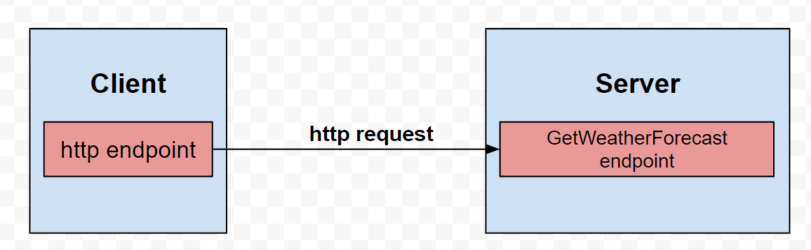
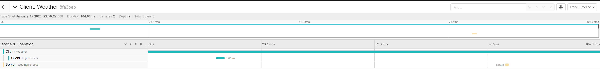
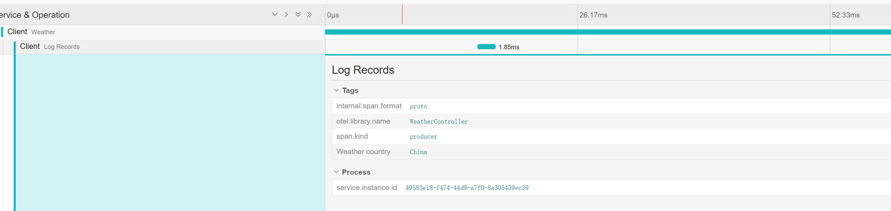

# jaeger-opentelemetry-demo

## Introduction
This repo describes a demo about how to use Opentelemetry with Jaeger across multi microservices.

## Content
This demo consists of two microservices: Client and Server.


- Client
  
  It's a ASP.NET Core Web API with .NET6. It has a `/weather` http get endpoint that http call to Server `weatherforecast` endpoint.
- Server

  It's a ASP.NET Core Web API with .NET6. It has a `weatherforecast` endpoint that forecast the weather.

## Prerequisits
- Docker desktop
  
  You can download Docker desktop with this [link](https://www.docker.com/products/docker-desktop/) and install it.
- Jaeger

  You can start Jaeger container in Docker Desktop with the following docker command:
  ```jaeger command
	docker run -d --name jaeger -e COLLECTOR_ZIPKIN_HTTP_PORT=19411 -p 5775:5775/udp -p 6831:6831/udp -p 6832:6832/udp -p 5778:5778 -p 16686:16686 -p 14268:14268 -p 19411:19411 jaegertracing/all-in-one
  ```
  And you can open it with browser: `localhost:16686`

## Getting Started
To get started with Opentelemtry in ASP.NET, you need to install the following nuget packages:
```libraries
    <PackageReference Include="OpenTelemetry" Version="1.4.0-rc.1" />
    <PackageReference Include="OpenTelemetry.Exporter.Jaeger" Version="1.4.0-rc.1" />
    <PackageReference Include="OpenTelemetry.Extensions.Hosting" Version="1.4.0-rc.1" />
    <PackageReference Include="OpenTelemetry.Instrumentation.AspNetCore" Version="1.0.0-rc9.10" />
    <PackageReference Include="OpenTelemetry.Instrumentation.Http" Version="1.0.0-rc9.10" />
```
To enable Opentelemetry in ASP.NET, you need to add the following code in `program.cs`:
```code
// Add Opentelemtry library
builder.Services.AddOpenTelemetry()
    .WithTracing(providerBuilder =>
    providerBuilder.AddAspNetCoreInstrumentation()
        .AddSource(nameof(WeatherForecastController))
        .SetResourceBuilder(ResourceBuilder.CreateDefault().AddService("Server"))
        .AddJaegerExporter(opts =>
        {
            opts.AgentHost = builder.Configuration["Jaeger:AgentHost"];
            opts.AgentPort = Convert.ToInt32(builder.Configuration["Jaeger:AgentPort"]);
            opts.ExportProcessorType = ExportProcessorType.Simple;
        }))
    .StartWithHost();
```
## Output


